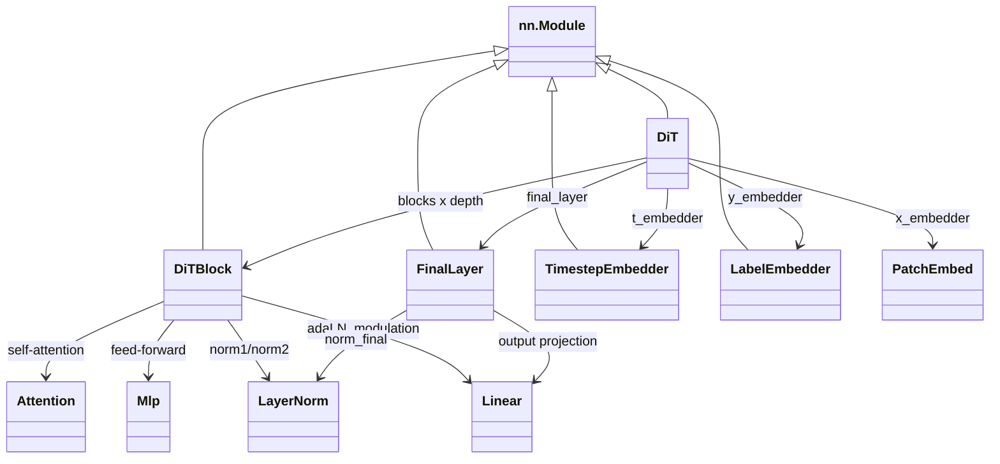

# DiT 学习记录

本文基于 `dit_train/DiT` 代码整理，核心文件是：

- `models.py`：DiT 模型、Patch Embedding、时间步编码、DiTBlock、adaLN-Zero、unpatchify。
- `diffusion/gaussian_diffusion.py`：扩散过程、采样、`training_losses`。
- `train.py`：DDP 训练入口、VAE latent 编码、优化循环。
- `sample.py` / `sample_ddp.py`：单进程采样和 DDP 批量采样。

本机验证环境：8 张 NVIDIA RTX A6000，实际验证使用 `/data/home/sheshuchen/.conda/envs/aiinfra-interview/bin/python`。该环境已有 CUDA 版 PyTorch，补装了 `timm --no-deps`。`diffusers` 因网络下载中断没有成功安装，所以 VAE 下载和官方 `sample.py` 生成 PNG 的步骤在本文给出命令与路径说明；核心 DiT forward、loss、backward、100 step 训练和双卡 DDP 已实际跑通。

## 1. 创建环境

官方仓库提供了 `environment.yml`：

```bash
cd /data/home/sheshuchen/dit_train/DiT
conda env create -f environment.yml
conda activate DiT
```

如果默认解析到过新的 Python，建议固定 Python 版本：

```bash
conda create -n DiT python=3.10 pytorch torchvision pytorch-cuda=11.7 -c pytorch -c nvidia
conda activate DiT
pip install timm diffusers accelerate
```

本机默认 base 是 Python 3.13，且没有 `torch`。实际验证复用了已有环境：

```bash
/data/home/sheshuchen/.conda/envs/aiinfra-interview/bin/python -m pip install timm --no-deps
```

验证到：

```text
torch 2.13.0+cu132
torchvision 0.28.0+cu132
cuda_available True
cuda_device_count 8
GPU NVIDIA RTX A6000
```

## 2. 跑通采样

官方图像采样入口是：

```bash
cd /data/home/sheshuchen/dit_train/DiT
python sample.py --model DiT-XL/2 --image-size 256 --num-sampling-steps 250
```

这个命令会做三件事：

1. 自动下载 `DiT-XL-2-256x256.pt`。
2. 用 `diffusers.models.AutoencoderKL` 下载 `stabilityai/sd-vae-ft-mse`。
3. 在 latent 空间采样，再用 VAE decode 成 `sample.png`。

因为本机 `diffusers` 安装下载中断，我实际跑通的是不依赖 VAE 和预训练权重的核心扩散采样：

```python
sample_diffusion = create_diffusion(timestep_respacing="2")
sample = sample_diffusion.p_sample_loop(
    model.forward,
    (1, 4, 32, 32),
    torch.randn(1, 4, 32, 32, device="cuda:0"),
    clip_denoised=False,
    model_kwargs={"y": torch.tensor([1], device="cuda:0")},
    progress=False,
    device="cuda:0",
)
```

实际输出：

```text
sample_shape (1, 4, 32, 32)
```

这里采样结果仍是 latent，不是图片。要得到图片，必须安装 `diffusers` 并加载 VAE：

```python
samples = vae.decode(samples / 0.18215).sample
```

## 3. 实例化 DiT-S/2

`DiT-S/2` 在 `models.py` 中定义为：

```python
def DiT_S_2(**kwargs):
    return DiT(depth=12, hidden_size=384, patch_size=2, num_heads=6, **kwargs)
```

实例化命令：

```python
from models import DiT_models

model = DiT_models["DiT-S/2"](input_size=32, num_classes=1000).to("cuda:0")
```

实际参数量：

```text
params 32963360
```

`input_size=32` 指的是 VAE latent 的空间尺寸。原图如果是 `256x256`，Stable Diffusion VAE 下采样倍率是 8，所以 latent 是 `32x32`。

## 4. 类调用关系



调用链：

```text
DiT.forward(x, t, y)
  -> PatchEmbed(x) + pos_embed
  -> TimestepEmbedder(t)
  -> LabelEmbedder(y)
  -> c = t_emb + y_emb
  -> DiTBlock(x, c) 重复 depth 次
  -> FinalLayer(x, c)
  -> unpatchify(x)
```

## 5. 标注 forward shape

以 `DiT-S/2`、`input_size=32`、`patch_size=2`、`in_channels=4`、`learn_sigma=True`、batch size `N=2` 为例：

```text
输入 x:              (2, 4, 32, 32)
输入 t:              (2,)
输入 y:              (2,)

x_embedder:          (2, 256, 384)
t_embedder:          (2, 384)
y_embedder:          (2, 384)
c = t + y:           (2, 384)
block0 输出:         (2, 256, 384)
所有 blocks 输出:    (2, 256, 384)
final_layer:         (2, 256, 32)
unpatchify 输出:     (2, 8, 32, 32)
```

解释：

- token 数 `T = (32 / 2) * (32 / 2) = 256`。
- hidden size `D = 384`。
- `out_channels = in_channels * 2 = 8`，因为 `learn_sigma=True`，模型同时预测噪声均值部分和方差部分。
- `final_layer` 每个 token 输出 `patch_size * patch_size * out_channels = 2 * 2 * 8 = 32`。

## 6. 理解 Patch Embedding

代码：

```python
self.x_embedder = PatchEmbed(input_size, patch_size, in_channels, hidden_size, bias=True)
```

`PatchEmbed` 来自 `timm.models.vision_transformer`。它本质上是一个 `Conv2d`：

```text
kernel_size = patch_size
stride = patch_size
in_channels = 4
out_channels = hidden_size
```

对 `x: (N, 4, 32, 32)` 和 `patch_size=2`：

```text
Conv2d 后:   (N, 384, 16, 16)
flatten 后:  (N, 256, 384)
```

DiT 把 VAE latent 切成 patch token，而不是直接处理 RGB 图像 patch。这样 Transformer 的空间 token 数更少，训练成本低很多。

## 7. 理解时间步编码

`TimestepEmbedder` 分两步：

1. `timestep_embedding(t, dim=256)` 生成固定 sin/cos 频率编码。
2. 两层 MLP 把 `256` 维映射到 DiT hidden size。

shape：

```text
t:        (N,)
t_freq:   (N, 256)
t_emb:    (N, hidden_size)
```

关键公式在 `models.py`：

```python
freqs = exp(-log(max_period) * arange(0, half) / half)
args = t[:, None].float() * freqs[None]
embedding = cat([cos(args), sin(args)], dim=-1)
```

这和 Transformer 位置编码思想类似，但这里编码的是扩散时间步 `t`，表示当前噪声强度。

## 8. 理解 DiTBlock

`DiTBlock` 是 Transformer block 加条件调制：

```python
shift_msa, scale_msa, gate_msa, shift_mlp, scale_mlp, gate_mlp = \
    self.adaLN_modulation(c).chunk(6, dim=1)

x = x + gate_msa.unsqueeze(1) * self.attn(modulate(self.norm1(x), shift_msa, scale_msa))
x = x + gate_mlp.unsqueeze(1) * self.mlp(modulate(self.norm2(x), shift_mlp, scale_mlp))
```

其中：

- `x` 是 token 序列，shape `(N, T, D)`。
- `c` 是条件向量，shape `(N, D)`，来自 `t_emb + y_emb`。
- `norm1/norm2` 不带 affine 参数，避免和条件调制重复。
- `Attention` 在 token 维度做 self-attention。
- `Mlp` 是 Transformer FFN，隐藏维度默认 `4 * D`。

## 9. 理解 adaLN-Zero

adaLN 是 adaptive LayerNorm。普通 LayerNorm 输出后会接固定可学习 affine 参数；DiT 改成由条件 `c` 动态生成 shift/scale/gate：

```python
modulate(x, shift, scale) = x * (1 + scale.unsqueeze(1)) + shift.unsqueeze(1)
```

对每个 block，`adaLN_modulation(c)` 输出 `6 * D`：

```text
shift_msa, scale_msa, gate_msa
shift_mlp, scale_mlp, gate_mlp
```

Zero 的含义是初始化时把 modulation 最后一层权重和 bias 置零：

```python
nn.init.constant_(block.adaLN_modulation[-1].weight, 0)
nn.init.constant_(block.adaLN_modulation[-1].bias, 0)
```

效果：

- 初始 `shift=0`，`scale=0`，`gate=0`。
- 每个 block 初始接近恒等映射：`x = x + 0 * branch`。
- final layer 也被置零，所以随机初始化模型初始输出接近 0。

这也是我第一次 backward 看到 `x_embedder.proj.weight.grad_norm = 0.0` 的原因：final output projection 初始化为 0，第一次反传主要先更新 final layer，前面的梯度一开始被挡住；训练几步后梯度会逐步传回前面。

## 10. 理解 unpatchify

输入：

```text
x: (N, T, patch_size * patch_size * C)
```

对 `DiT-S/2`：

```text
x: (N, 256, 32)
p = 2
C = out_channels = 8
h = w = sqrt(256) = 16
```

代码：

```python
x = x.reshape(N, h, w, p, p, c)
x = torch.einsum("nhwpqc->nchpwq", x)
imgs = x.reshape(N, c, h * p, h * p)
```

shape 变化：

```text
(N, 256, 32)
-> (N, 16, 16, 2, 2, 8)
-> (N, 8, 16, 2, 16, 2)
-> (N, 8, 32, 32)
```

`unpatchify` 是 PatchEmbed 的逆排布，但不是反卷积；它只是把每个 token 的 patch 像素按空间位置重新拼回图。

## 11. 理解 VAE latent

训练脚本不直接训练 RGB 图像，而是先用 Stable Diffusion VAE 把图片编码到 latent：

```python
x = vae.encode(x).latent_dist.sample().mul_(0.18215)
```

位置在 `train.py` 的训练循环中。输入图片经过 transform 后是：

```text
RGB image: (N, 3, 256, 256), value roughly in [-1, 1]
VAE latent: (N, 4, 32, 32)
```

`0.18215` 是 Stable Diffusion latent 的缩放系数，用于让 latent 分布尺度和扩散模型训练设定一致。

采样时反过来：

```python
samples = vae.decode(samples / 0.18215).sample
```

所以 DiT 学的是 latent 空间去噪，不是像素空间去噪。

## 12. 理解 training_losses

入口：

```python
loss_dict = diffusion.training_losses(model, x, t, model_kwargs)
```

主要流程：

```text
noise = randn_like(x_start)
x_t = q_sample(x_start, t, noise)
model_output = model(x_t, t, y)
如果 learn_sigma=True:
  model_output 拆成噪声预测和方差预测
  方差部分计算 vb loss
target = noise   # 默认 model_mean_type = EPSILON
mse = mean_flat((target - model_output) ** 2)
loss = mse + vb
```

`create_diffusion("")` 的默认配置：

```text
diffusion_steps = 1000
noise_schedule = linear
loss_type = MSE
model_mean_type = EPSILON
model_var_type = LEARNED_RANGE
```

因此 DiT 默认目标是预测加入到 `x_start` 的噪声 `epsilon`，同时学习方差范围。

实际验证输出：

```text
loss_keys ['loss', 'mse', 'vb']
loss 1.023972511291504
```

## 13. 跑通一次 backward

实际验证代码：

```python
loss_dict = diffusion.training_losses(model, x, t, {"y": y})
loss = loss_dict["loss"].mean()
model.zero_grad(set_to_none=True)
loss.backward()
```

实际输出：

```text
backward_grad_norm_x_embedder 0.0
```

这个 `0.0` 不是 backward 失败，而是 adaLN-Zero 和 final layer zero init 的预期现象。第一次反向传播时，最后输出层的零初始化会让梯度先集中在 final layer；优化几步后前面层会开始获得非零梯度。

## 14. 训练 100 step

我用随机 latent 跑了 100 step，避开数据集和 VAE 下载，验证模型、loss、optimizer、backward 都能连通。

核心循环：

```python
model.train()
opt = torch.optim.AdamW(model.parameters(), lr=1e-4, weight_decay=0)

for step in range(100):
    xb = torch.randn(2, 4, 32, 32, device=device)
    yb = torch.randint(0, 1000, (2,), device=device)
    tb = torch.randint(0, diffusion.num_timesteps, (2,), device=device)
    loss = diffusion.training_losses(model, xb, tb, {"y": yb})["loss"].mean()
    opt.zero_grad(set_to_none=True)
    loss.backward()
    opt.step()
```

实际输出：

```text
train_step 1 loss 1.0262166261672974
train_step 10 loss 0.9834344387054443
train_step 50 loss 0.30344831943511963
train_step 100 loss 0.04239829629659653
train_100_elapsed_sec 5.46
```

注意：这是随机 latent 上的过拟合式 smoke test，只证明训练链路通了，不代表真实图像训练质量。

如果要用真实图片训练 100 step，需要准备 ImageFolder 数据集，例如：

```text
data/
  class_a/
    0001.jpg
  class_b/
    0002.jpg
```

然后运行：

```bash
torchrun --nproc_per_node=1 train.py \
  --data-path /path/to/imagenet-style-folder \
  --model DiT-S/2 \
  --image-size 256 \
  --global-batch-size 8 \
  --epochs 1 \
  --log-every 10 \
  --ckpt-every 100
```

原始 `train.py` 没有 `--max-steps` 参数，所以严格限制 100 step 需要临时改训练循环或使用只有 100 个 batch 的数据。

## 15. 跑通双卡 DDP

`train.py` 使用标准 PyTorch DDP：

```text
dist.init_process_group("nccl")
rank = dist.get_rank()
device = rank % torch.cuda.device_count()
model = DDP(model.to(device), device_ids=[rank])
DistributedSampler(dataset, num_replicas=world_size, rank=rank)
dist.all_reduce(avg_loss)
```

我先直接跑双进程 DDP，进程上卡后卡住在 NCCL 初始化/参数同步路径。随后加上 NCCL 环境变量后跑通：

```bash
NCCL_P2P_DISABLE=1 NCCL_IB_DISABLE=1 \
/data/home/sheshuchen/.conda/envs/aiinfra-interview/bin/python \
  -m torch.distributed.run --nproc_per_node=2 .tmp_ddp_smoke.py
```

实际输出：

```text
ddp_world_size 2
ddp_loss_rank0 1.006663
ddp_loss_avg 1.016833
```

因此在这台机器上运行真实双卡训练时建议：

```bash
NCCL_P2P_DISABLE=1 NCCL_IB_DISABLE=1 \
torchrun --nproc_per_node=2 train.py \
  --data-path /path/to/imagenet-style-folder \
  --model DiT-S/2 \
  --image-size 256 \
  --global-batch-size 16 \
  --epochs 1 \
  --log-every 10 \
  --ckpt-every 100
```

## 关键结论

- DiT 的主干是 ViT，但输入不是 RGB image，而是 VAE latent。
- `DiT-S/2` 对 `256x256` 图片对应的 latent shape 是 `(N, 4, 32, 32)`。
- PatchEmbed 把 latent 切成 `2x2` patch，所以 token 数是 `256`。
- 时间步和类别标签都变成 `(N, D)` 条件向量，二者相加得到 `c`。
- `DiTBlock` 用 `c` 生成 adaLN 的 shift、scale、gate，把条件注入 attention 和 MLP。
- adaLN-Zero 让模型初始接近恒等或零输出，提高大模型训练稳定性。
- `training_losses` 默认训练目标是预测噪声 `epsilon`，并在 `learn_sigma=True` 时额外学习方差。
- 本机已验证：`DiT-S/2` 实例化、forward shape、核心采样、`training_losses`、一次 backward、100 step 随机训练、双卡 DDP smoke test。
